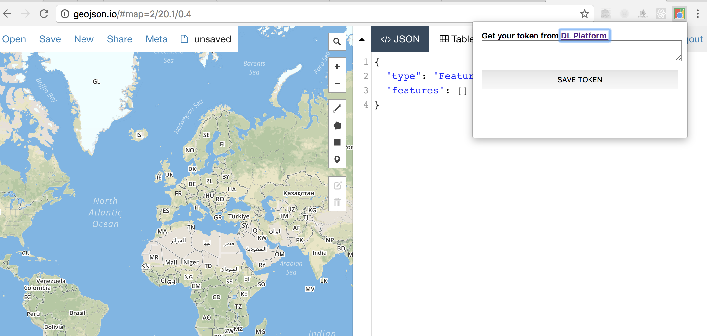
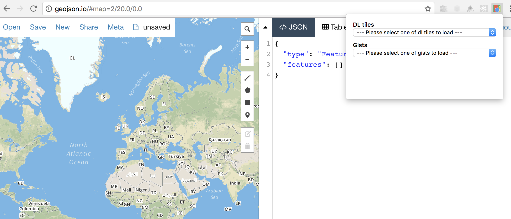

### geojson.io extension for Descartes Labs products

- This chrome extension fetches Descartes Labs' static tile id and json gists to load directly to geojson.io [using geojson.io api](https://github.com/mapbox/geojson.io#api).

- This extension is not available through Chrome Web store. You can [install by loading unpacked ](https://developer.chrome.com/extensions/getstarted#unpacked).

- Screenshots

